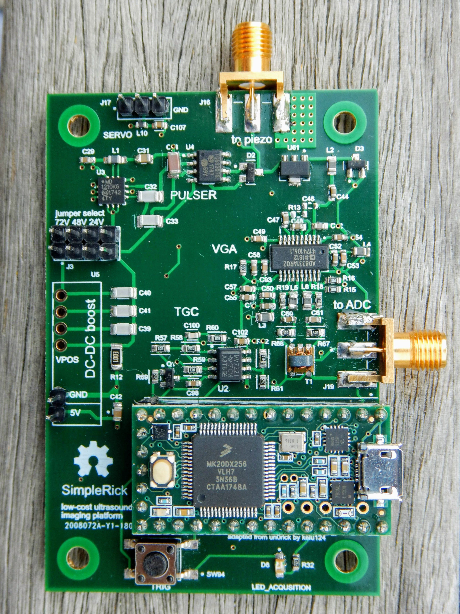

# SimpleRick

[Software](https://github.com/wlmeng11/rtl-ultrasound)
&larr;
[Firmware](https://github.com/wlmeng11/SimpleRick_firmware)
&larr;
**Hardware**

Low-cost 2D ultrasound imaging hardware for makers

## Introduction
_“Come home to the impossible flavor of your own completion. Come home to Simple Rick's.”_

Based on kelu124’s [un0rick](http://un0rick.cc/), this project aims to provide hardware and software to perform 2D ultrasound imaging
at a cost affordable makers and electronics hobbyists.
To accomplish this, I’ve made a number of simplifications and modifications such as:

* removing the FPGA and its supporting circuitry
* using cheaper substitutes for some components
* reducing board size
* ramp generator provides TGC with slow DAC update
* offload data acquistion to RTL-SDR with [rtl-ultrasound](https://github.com/wlmeng11/rtl-ultrasound)

Of course, these changes come at the expensive of flexibility and extensibility.
If all you want to do is get ultrasound images onto your computer as cheaply as possible, this project is for you.
If you want to do anything fancy like real-time processing, sophisticated motor control, integration with other sensors,
standalone capability, wireless operation, etc. then you’ll be better served by un0rick.

More to come soon!

## Overview of System Architecture
SimpleRick is a B-mode ultrasound imaging device.

### Piezoelectric Transducer
The interface between the electrical and acoustic domains is the piezoelectric transducer, henceforth referred to as the piezo.
I'm using the STEMiNC [SMD07T05R412WL](https://www.steminc.com/PZT/en/disc-7x05mm-r-wire-leads-4-mhz) piezo,
which has a resonant frequency of 4.25 MHz.

### Transmit (Tx)
The piezo is excited by a short electrical pulse, which is meant to approximate the impulse function.
Because the piezo has a sharply resonant frequency response, it responds to the quasi-impulse excitation by vibrating at its resonant frequency.

### T/R Switch
MD0100

### Receive (Rx)
AD8331

### Time Gain Compensation (TGC)
An echo that is heard later in time will have traveled through a further distance in the medium.
Because acoustic power decays exponentially as the wave propogates through a medium, 
the received signal will decay exponentially with time. 
To compensate for this attenuation, the receiver gain should increase exponentially over time.
The gain of the AD8331 varies exponentially with the voltage on its GAIN pin,
therefore a linear ramp signal is sufficient to drive the GAIN pin.

In order to minimize computational overhead and I/O bandwidth in the microcontroller,
the ramp signal is generated by a *Howland integrator* circuit.
By integrating a constant (but adjustable by the microcontroller) voltage, a linear ramp signal is generated,
whose slope is determined by the time constant of an RC network.
The output of the integrator is fed to a comparator which resets the integrator when its voltage exceeds the reference voltage (1V, which corresponds to maximum gain in the AD8331).

I chose the LMV722 because it is a low-voltage rail-to-rail opamp with sufficient bandwidth for this application.

### Data Acquistion
The ultrasound signal data is acquired using an RTL-SDR, which provides an Analog-to-Digital Converter (ADC), Digital Down-Converter (DDC), and data streaming to a host computer over USB.

### 2D imaging
A servo motor is used to sweep the angle of the piezo in order to capture a 2D image.

## Ultrasound Signal Simulator
In order to test the data acquisition via RTL-SDR and software processing without having to set up all this hardware,
I figured out how to use the HackRF as a signal generator to simulate an ultrasound signal.
See [here](experiments/20180807/hackrf_ultrasound_simulator.ipynb) for details.

## Links
* [Most recent PCB design in Upverter](https://upverter.com/wlmeng11/a188e8df0fe636d4/SimpleRick/)
* [Hackaday page](https://hackaday.io/project/160196-simplerick)
* [Slack channel](https://usdevkit.slack.com/messages/simplerick/)

## DISCLAIMER
This is NOT a medical device. Ultrasound technology can expose a user to hazards including but not limited to: high voltages, tissue-damaging acoustic waves, and materials containing lead (Pb). I am not liable for any injuries, death, or destruction of property that may occur as a result of using any materials provided by this project. You have been warned!

## LICENSE
The hardware in this project (located in subdirectory `hardware/`) is based on [un0rick](http://un0rick.cc/) (Copyright kelu124 2018),
and is similarly distributed under the [TAPR Open Hardware License](https://www.tapr.org/ohl.html).

The firmware in this project (located in subdirectory `firmware/`) is licensed under GPL v3.

The full text of each license can be found in the respective subdirectories.

Copyright (C) 2018 William Meng
