# SimpleRick PCB v1.1

| Field        | Value        |
|--------------|--------------|
| Version      | 1.1          |
| Author       | William Meng |
| Date         | 08/06/18     |
| Designed in  | Upverter     |
| License      | TAPR OHL     |
| Dimensions   | 2"x3"        |
| Layers       | 4            |
| Manufacturer | JLC PCB      |

## Additional hardware
#### Minimal setup
* STEMiNC [SMD07T05R412WL](https://www.steminc.com/PZT/en/disc-7x05mm-r-wire-leads-4-mhz) piezo
* [Teensy 3.2](https://www.amazon.com/dp/B015M3K5NG/)
* micro USB cable
* header pins
* jumper wires, M-F
* [XL6009 Boost Converter module](https://www.amazon.com/eBoot-Converter-Voltage-Adjustable-Step-up/dp/B06XWSV89D/)
* [SG90 micro servo motor](https://www.amazon.com/Micro-Helicopter-Airplane-Remote-Control/dp/B072V529YD/)
* [SMA cables](https://www.amazon.com/DZS-Elec-Connecting-Coaxial-Extender/dp/B072FS4WMK/)
* 12.5 MHz low pass filter
* [RTL-SDR v3](https://www.amazon.com/RTL-SDR-Blog-RTL2832U-Software-Defined/dp/B0129EBDS2/)
* computer with USB ports

#### Setup for debugging
* SMA splitter
* SMA to BNC adapter
* BNC cables
* oscilloscope with probes

## Photos
#### Unassembled
Rendering by OSH Park
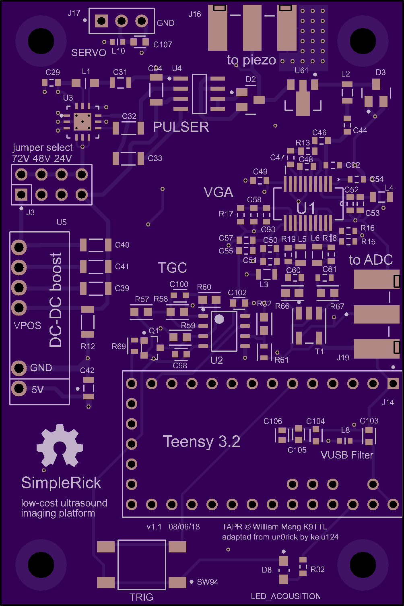
Bare PCB, front
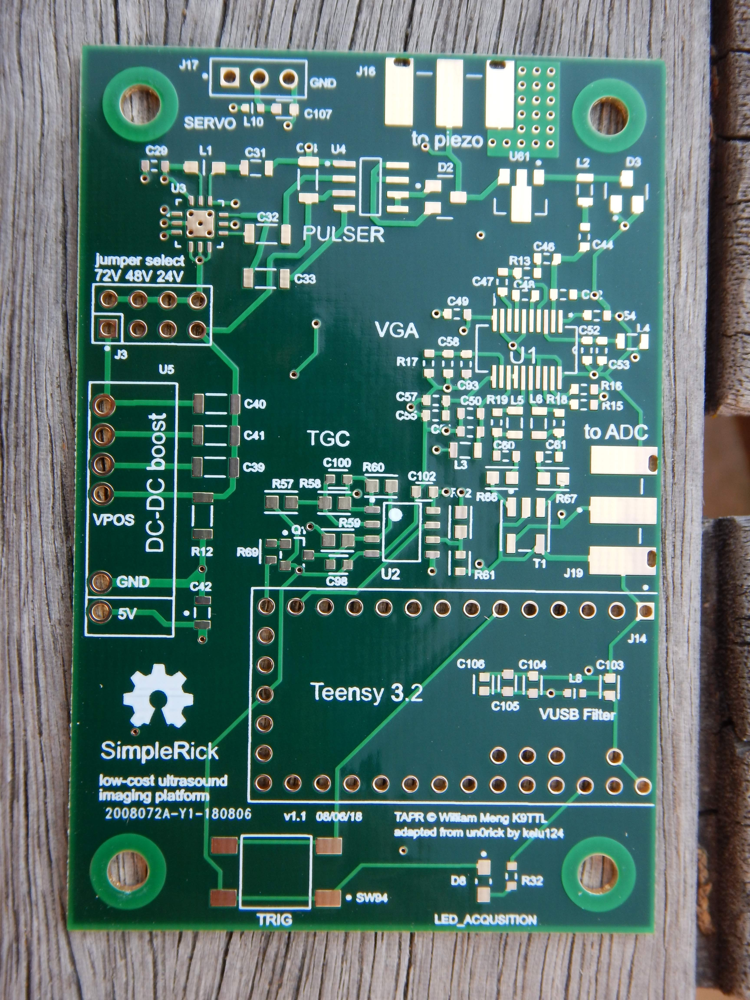

#### Assembled
Assembled PCB, front

Assembled PCB, test points on back
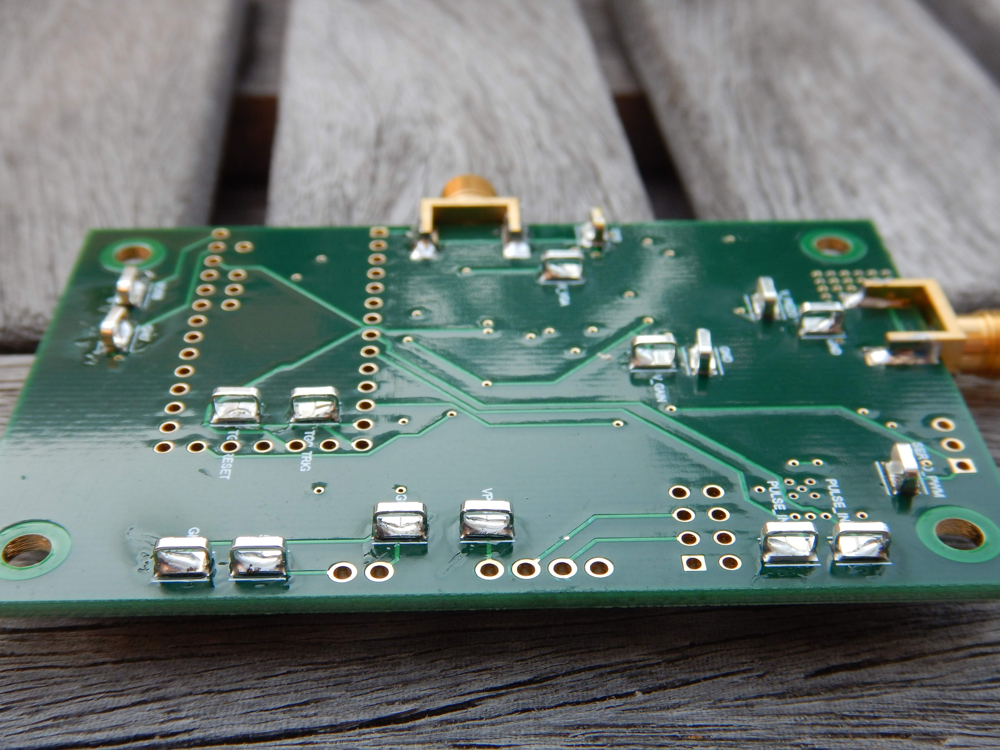
Side view
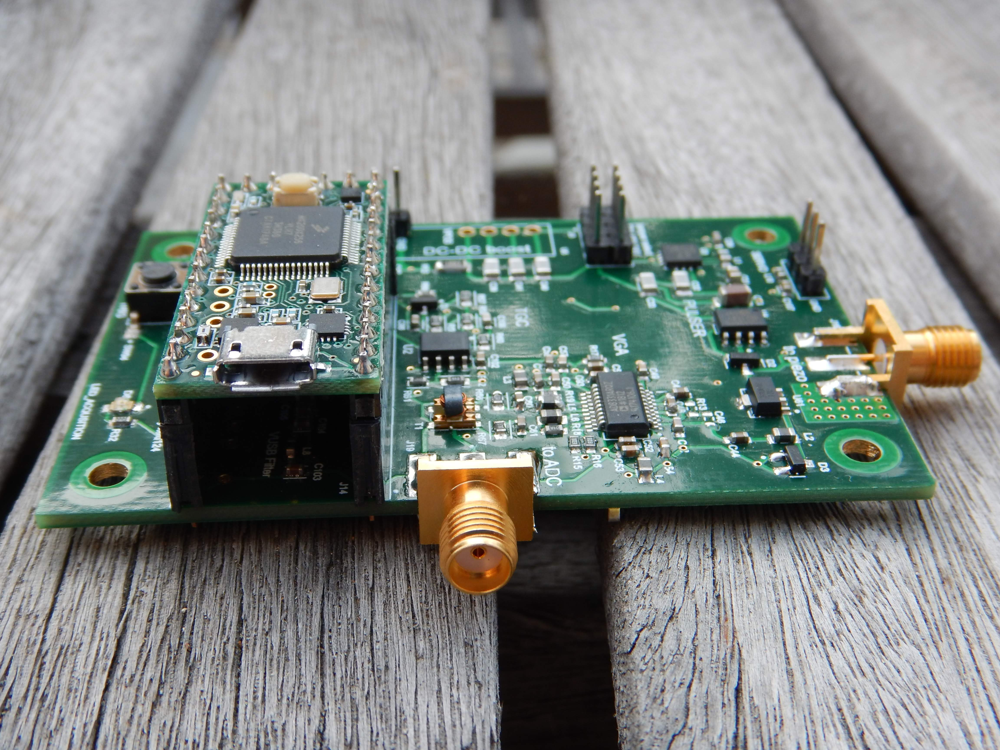
Another side view
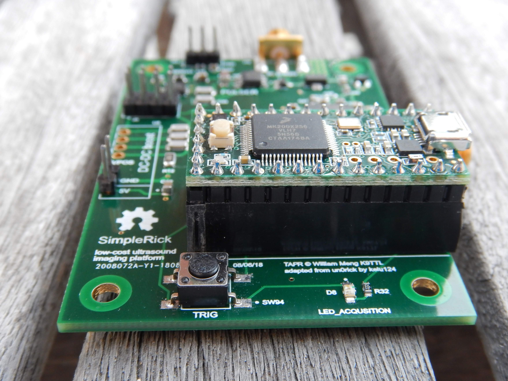
Close up of analog circuits
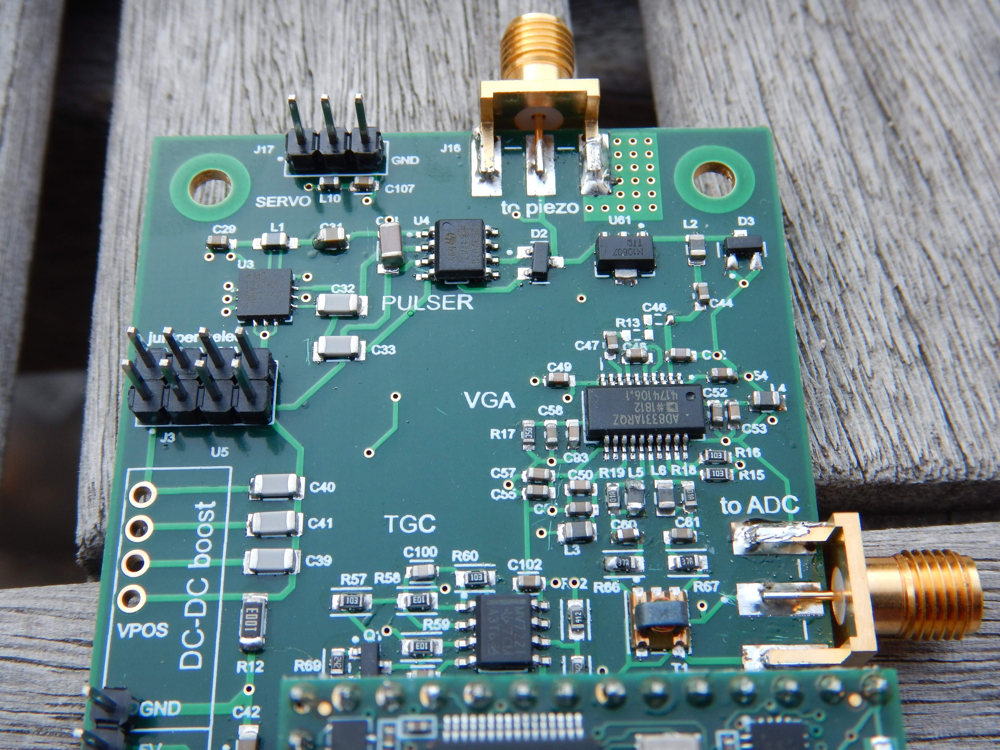

#### Setup
Connecting XL6009 boost converter to VPOS and GND
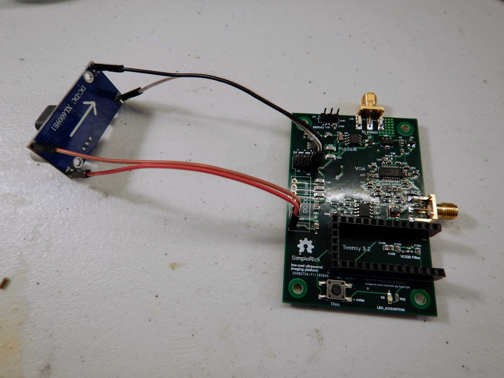
Solder piezo to female SMA connector
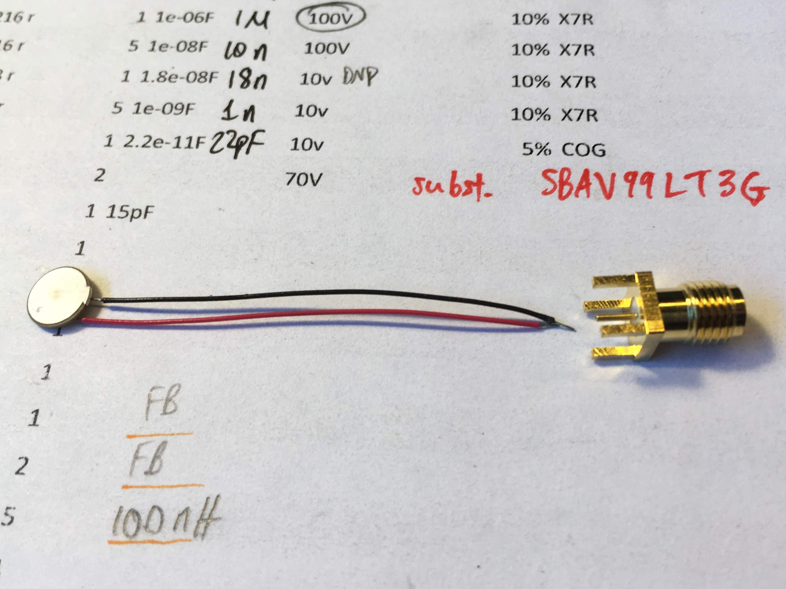
Attaching piezo to motor
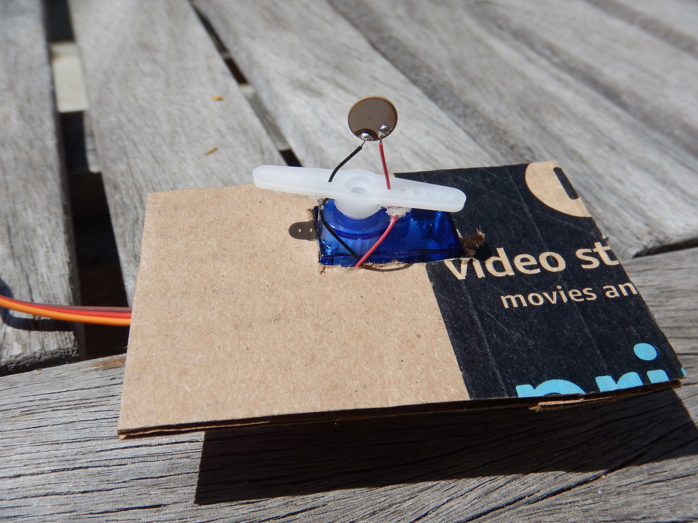
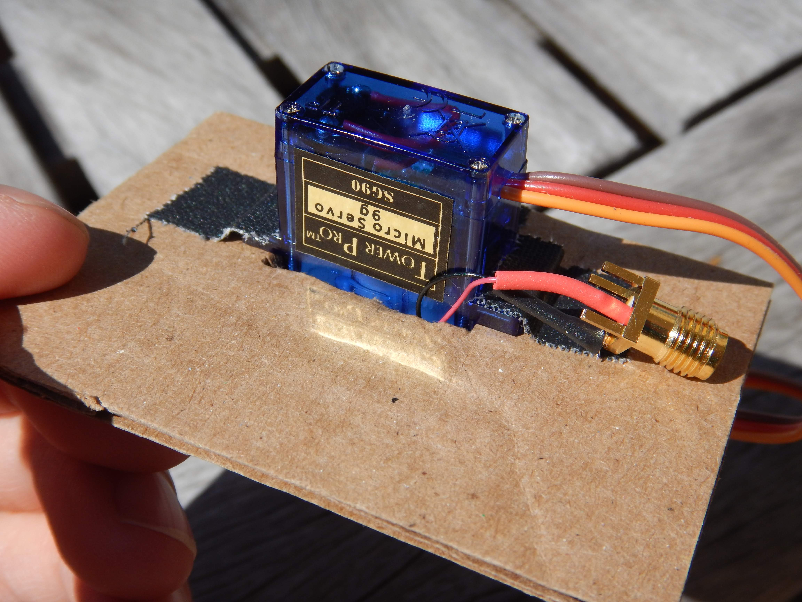
Anechoic chamber

Making the connections
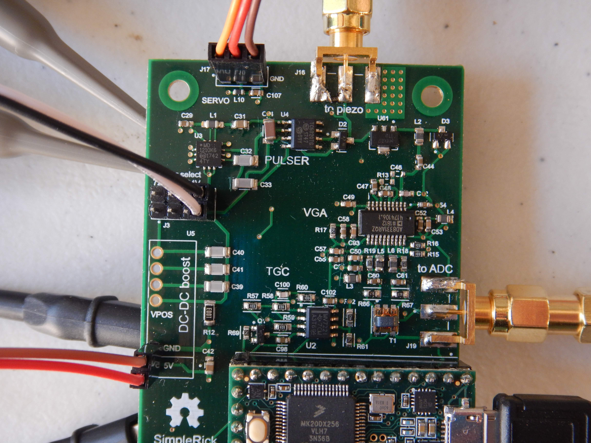
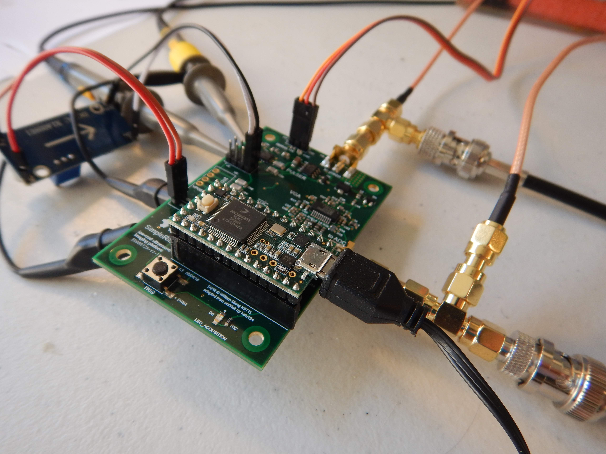

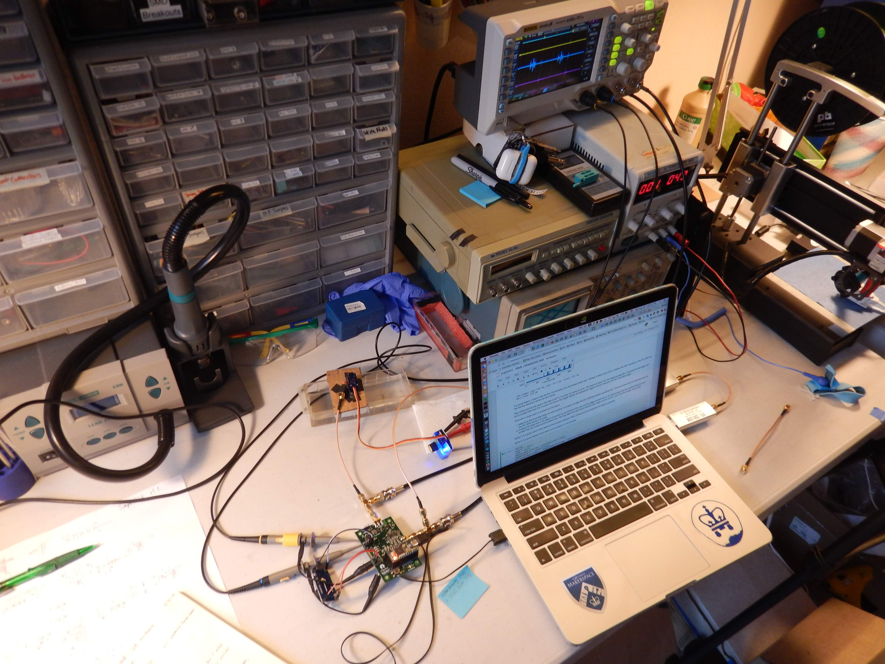

## Next Steps
Errata in PCB layout:

* swapped labels for V_PIEZO and GND testpoints
* LED\_ACQUISITION should say LED\_PWR
* some silkscreen labels are cutoff by vias
* GND testpoint for V\_GAIN is inconveniently placed too close to V\_GAIN testpoint

Things to be improved:

* high current traces should be wider
* add bleeder resistor between V_PIEZO and GND
* insufficient decoupling for servo motor
* separate AGND and DGND planes
* reduce usage of high value MLCC due to supply shortage
* use larger components for VUSB filter
* get premade connectors for attaching Teensy
* LEDs for: 5V, 3.3V, acquisition
* servo power rail needs more decoupling
* make silkscreen info (author, license, version, etc) more readable... consider moving it to back